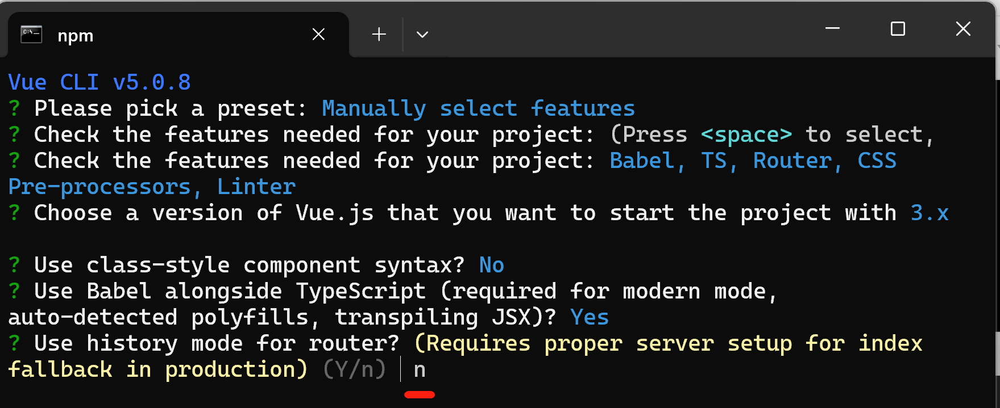
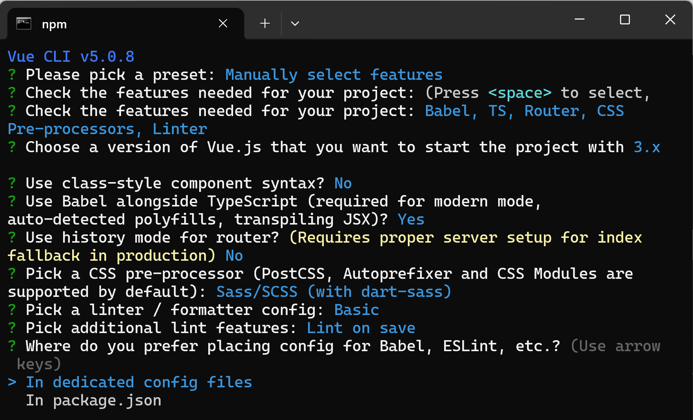
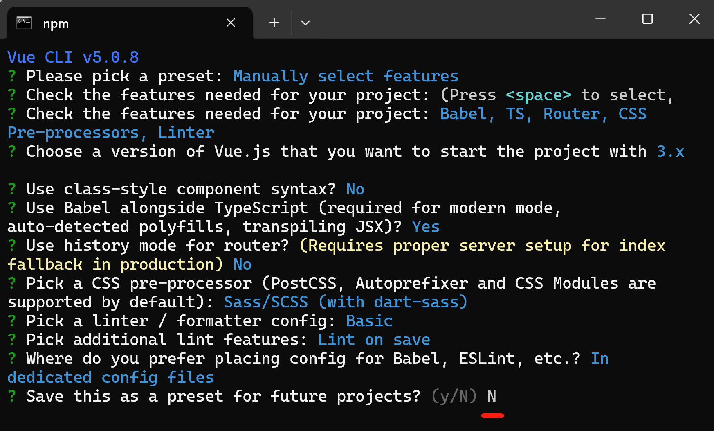

_[English](README.md) | 简体中文_

# trtc-electron-template-vue3-webpack

本工程是一个使用 webpack 构建、集成 vue3 和 [trtc-electron-sdk](https://www.npmjs.com/package/trtc-electron-sdk) 的模板工程。

核心技术特性:
- Vue3
- Webpack
- trtc-electron-sdk
- Electron
- TypeScript

## 运行此模板工程

### 获取源码
```bash
git clone https://github.com/Tencent-RTC/TRTC_Electron.git

cd trtc-electron-template-vue3-webpack
```

### 开发模式运行
1. 打开一个命令行终端，执行以下命令：
```bash
npm install

npm run serve
```
2. 打开另一个命令行终端，执行以下命令：
```bash
npm run start
```

### 构建安装包
构建的安装包在 `release` 目录下，可以按照运行。
```bash
npm run pack:win
npm run pack:mac
```


## 当前这个模板工程是如何创建的？

如果您想亲自动手创建一个能够集成 `trtc-electron-sdk` 的工程，可以参照以下步骤说明。

### 1. 创建一个支持 vue3/TypeScript/webpack 的 Web 工程

#### 1.1 安装 `@vue/cli`
```bash
npm install -g @vue/cli
```

#### 1.2 创建工程
```bash
vue create trtc-electron-template-vue3-webpack
```

#### 1.3 选择 `Manually select features`


#### 1.4 选择 `Babel`, `TypeScript`, `Router`, `CSS Pre-processors` and `Linter / Formatter`, 按 'Enter/回车键' 继续


#### 1.5 选择 `3.x`


#### 1.6 `Use class-style component syntax?`, 输入 'N'，按 'Enter/回车键' 继续。这一步不强制必须选择哪种方式，可以根据您的喜好自由选择。


#### 1.7 `Use Babel alongside TypeScript(...)`, 输入 'Y'，按 'Enter/回车键' 继续。


#### 1.8 `Use history mode for router?(...)`, 输入 'n'，按 'Enter/回车键' 继续。由于安装包是以 `file://` 协议访问本地文件运行, `history mode` 将不会生效。所以，这一步必须输入 'n' 选择 `Hash mode for router` 模式，以便支持 `file://` 协议方式加载文件运行。



#### 1.9 `Pick a CSS pre-processer(...)`, 选择 `Sass/SCSS （with dart-sass）`. 大部分 `trtc-electron-sdk` demo 和 UI  工程使用 `Sass/Scss`，选择 `Sass/SCSS` 更便于您接入我们 UI 工程。


#### 1.10 `Pick a linter / formatter config`. 对选择结果无强制要求，可以更具您的偏好自由选择。 本模板工程中，我们选择了 `ESlint with error prevention only`。


#### 1.11 `Pick additinal lint features` 选择 `Lint on save`.


#### 1.12 `Where do you prefer placing confi for ...` 选择 `In dedicated config files`. 对选择结果无强制要求, 但我们建议选择 `In dedicated config files`，在项目变得复杂时，有更好的灵活性在调整项目配置。


#### 1.13 `Save this as a preset for future project?`, 输入 'N' 并按 'Enter/回车键'继续。对选择结果无强制要求，可以更具您的偏好自由选择。


#### 1.14 到此，您已经创建一个具有 vue3/webpack/TypeScript 支持的 Web 工程。

### 2 支持在 Electron 中运行

#### 2.1 安装 `electron` 和 `electron-builder`.
```bash
cd trtc-electron-template-vue3-webpack

npm install --save-dev electron electron-builder
```

#### 2.2 在项目根目录下新增 `main.js` 文件，录入以下代码。
```javascript
// main.js
const { app, BrowserWindow } = require('electron');
const path = require('path');

const createWindow = () => {
  const mainWindow = new BrowserWindow({
    width: 800,
    height: 600,
    webPreferences: {
      preload: path.join(__dirname, 'preload.js'),
      nodeIntegration: true,
      contextIsolation: false,
    }
  })

  if(app.isPackaged) {
    mainWindow.loadFile('dist/index.html');
  } else {
    mainWindow.loadURL('http://localhost:8080');
  }
}

app.whenReady().then(() => {
  createWindow();

  app.on('activate', () => {
    if (BrowserWindow.getAllWindows().length === 0) createWindow();
  })
});

app.on('window-all-closed', () => {
  if (process.platform !== 'darwin') app.quit();
});
```

#### 2.3 在项目根目录下新增 `preload.js` 文件，录入以下代码。
```javascript
const { ipcRenderer } = require("electron");

// Enable `ipcRenderer` can be used in vue and Javascript module
window.ipcRenderer = ipcRenderer;
```

#### 2.4 在 `package.json` 中新增以下配置
```json
{
  "main": "main.js",
  "scripts": {
    "start": "electron ."
  }
}
```

#### 2.5 在 Electron 中运行创建的 Web 项目
- 打开一个命令行终端，执行以下命令：
```bash
npm run serve
```
- 上一步执行完成后，打开另一个命令行终端，执行以下命令：
```bash
npm run start
```

### 3 增加 trtc-electron-sdk 支持

#### 3.1 安装 `trtc-electron-sdk` 和 `native-ext-loader`
```bash
npm install trtc-electron-sdk

npm install --save-dev native-ext-loader
```

#### 3.2 在 `vue.config.js` 文件中，增加 `native-ext-loader` 相关配置
```javascript
// vue.config.js
const { defineConfig } = require('@vue/cli-service');
const os = require("os");

const isProduction = process.env.NODE_ENV === "production";
const platform = os.platform();

module.exports = defineConfig({
  transpileDependencies: true,
  publicPath: "./",
  configureWebpack: {
    devtool: isProduction ? "source-map" : "inline-source-map",
    target: "electron-renderer",
    module: {
      rules: [
        {
          test: /\.node$/,
          loader: "native-ext-loader",
          options: {
            rewritePath: isProduction
              ? platform === "win32"
                ? "./resources"
                : "../Resources"
              : "./node_modules/trtc-electron-sdk/build/Release",
          },
        },
      ],
    },
  }
});
```

#### 3.3 探索 `trtc-electron-sdk`
修改 `App.vue` 文件以展示 SDK 的版本号。您也可以参阅我们 [SDK API](https://web.sdk.qcloud.com/trtc/electron/doc/en-us/trtc_electron_sdk/index.html) 来探索、体验更多功能和特性。
```vue
<!-- App.vue -->
<template>
  <h1>TRTC SDK version:{{ sdkVersion }}</h1>
  <router-view/>
</template>

<script setup lang="ts">
import { ref, onMounted } from 'vue';
import type { Ref} from 'vue';
import TRTCCloud from 'trtc-electron-sdk';

const sdkVersion: Ref<string> = ref('');

onMounted(() => {
  const trtcCloud = TRTCCloud.getTRTCShareInstance();
  sdkVersion.value = trtcCloud.getSDKVersion();
});
</script>

<style lang="scss">
#app {
  font-family: Avenir, Helvetica, Arial, sans-serif;
  -webkit-font-smoothing: antialiased;
  -moz-osx-font-smoothing: grayscale;
  text-align: center;
  color: #2c3e50;
}

nav {
  padding: 30px;

  a {
    font-weight: bold;
    color: #2c3e50;

    &.router-link-exact-active {
      color: #42b983;
    }
  }
}
</style>
```

为了 UI 展示清晰和突出 SDK 版本号信息，我们删除了一些 `@vue/cli` 自动生成的代码。当您运行本模板工程时，您将看到如下图所示的界面。


### 4 支持构建安装包

#### 4.1 新增 `electron-builder` 配置文件
在项目根目录下，新建 `electron-builder.json5` 并录入下方代码。您可以根据你的需求修改 `productName` 和 `appId` 属性。
```json
/**
 * @see https://www.electron.build/configuration/configuration
 */
{
  "productName": "trtc-electron-template-vue3-webpack",
  "appId": "com.team-company-name.trtc-electron-template-vue3-webpack",
  "asar": true,
  "asarUnpack": "**\\*.{node,dll}",
  "directories": {
    "output": "release/${version}"
  },
  "files": [
    "dist/**/*",
    "*.js",
    "!node_modules"
  ],
  "mac": {
    "artifactName": "${productName}_${version}.${ext}",
    "extraFiles": [
      {
        "from": "node_modules/trtc-electron-sdk/build/Release/${arch}/trtc_electron_sdk.node",
        "to": "./Resources"
      },
      {
        "from": "node_modules/trtc-electron-sdk/build/mac-framework/${arch}/",
        "to": "./Frameworks"
      }
    ],
    "target": ["dmg"],
    "entitlements": "scripts/entitlements.mac.plist",
    "entitlementsInherit": "scripts/entitlements.mac.plist",
    "extendInfo": {
      "NSCameraUsageDescription": "Need camera permission",
      "NSMicrophoneUsageDescription": "Need microphone permission",
    },
  },
  "win": {
    "artifactName": "${productName}_${version}.${ext}",
    "extraFiles": [
      {
        "from": "node_modules/trtc-electron-sdk/build/Release/",
        "to": "./resources",
        "filter": [
          "**/*"
        ]
      },
    ],
    "target": ["nsis", "zip"],
  },
  "nsis": {
    "oneClick": false,
    "perMachine": true,
    "allowToChangeInstallationDirectory": true,
    "deleteAppDataOnUninstall": true,
    "createDesktopShortcut": true,
    "runAfterFinish": true,
  }
}
```

#### 4.2 在 `package.json` 中新增构建命令
构建好的安装包位于 `release` 下面，如下所示，是按照包构建命令。
```json
{
  "scripts": {
    "build:win64": "electron-builder --win --x64",
    "build:mac-x64": "electron-builder --mac --x64",
    "build:mac-arm64": "electron-builder --mac --arm64",
    "pack:win64": "npm run build && npm run build:win64",
    "pack:mac-x64": "npm run build && npm run build:mac-x64",
    "pack:mac-arm64": "npm run build && npm run build:mac-arm64"
  }
}
```

#### 4.3 修改 `.gitignore` 配置文件，忽略 `release` 目录
```
# .gitignore

.DS_Store
node_modules
/dist
/release      # 新增代码行
```