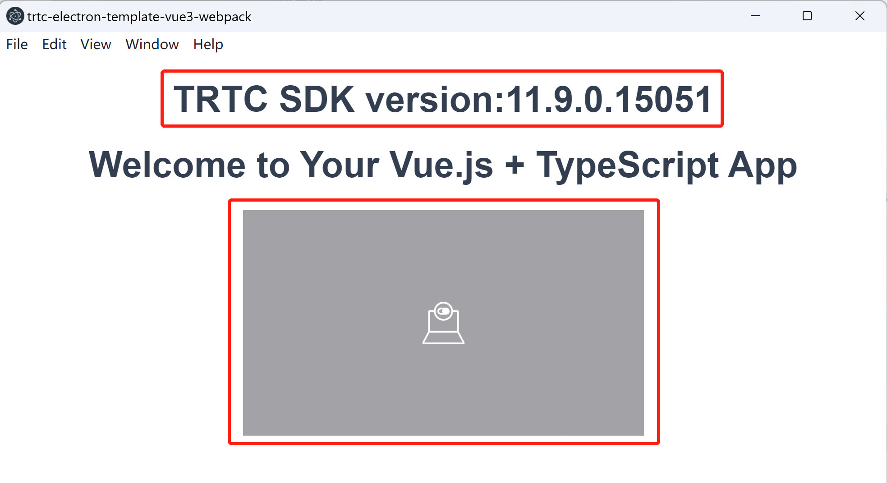

_English | [简体中文](README.zh-CN.md)_

# trtc-electron-template-vue3-webpack

This is a template project which integrated vue3 and [trtc-electron-sdk](https://www.npmjs.com/package/trtc-electron-sdk) to build with webpack.

Core techonoloty features:
- Vue3
- Webpack
- trtc-electron-sdk
- Electron
- TypeScript

## Run this template project

### Get the code
```bash
git clone https://github.com/Tencent-RTC/TRTC_Electron.git

cd trtc-electron-template-vue3-webpack
```

### Run in development mode
1. Open a terminal and run following command
```bash
npm install

npm run serve
```
2. Open another terminal and run following command
```bash
npm run start
```

### Run in production mode
The built installation is in `release`. You can install and run.
```bash
npm run pack:win
npm run pack:mac
```


## How this template project come into life?

### 1. Create a Web project with vue3/TypeScript/webpack support

#### 1.1 Install `@vue/cli`
```bash
npm install -g @vue/cli
```

#### 1.2 Create the project
```bash
vue create trtc-electron-template-vue3-webpack
```

#### 1.3 Choose `Manually select features`


#### 1.4 Enable `Babel`, `TypeScript`, `Router`, `CSS Pre-processors` and `Linter / Formatter`, the press 'Enter' to go on


#### 1.5 Choose `3.x`


#### 1.6 `Use class-style component syntax?`, enter 'N'. The 'N' option is not mandatory, you can choose according your preference.


#### 1.7 `Use Babel alongside TypeScript(...)`, enter 'Y'.


#### 1.8 `Use history mode for router?(...)`, enter 'n'. As the built installation package will load page with `file://` protocol, `history mode` will not work. So enter 'n' to enable `Hash mode for router` to work with `file://` protocal.


#### 1.9 `Pick a CSS pre-processer(...)`, choose `Sass/SCSS （with dart-sass）`. Most of `trtc-electron-sdk` demo and UI  project use `Sass/Scss`， this choice will make your work easy with our demo and UI applcation.


#### 1.10 `Pick a linter / formatter config`. No mandatory for this config, choose any one you like. Here we choose the basic and simple one: `ESlint with error prevention only`.


#### 1.11 `Pick additinal lint features` and choose `Lint on save`.


#### 1.12 `Where do you prefer placing confi for ...` and choose `In dedicated config files`. No mandatory for this option, but we suggest `In dedicated config files` whick can be more flexible when the project gets bigger or more complicated in its lifetime.


#### 1.13 `Save this as a preset for future project?`, enter 'N' and go on. The 'N' option is not mandatory.


#### 1.14 Here a project with vue3, Webpack and TypeScript project is created.

### 2 Enable running in Electron

#### 2.1 Instal `electron` and `electron-builder`.
```bash
cd trtc-electron-template-vue3-webpack

npm install --save-dev electron electron-builder
```

#### 2.2 Add file `main.js` with the following code in the project root directory.
```javascript
// main.js
const { app, BrowserWindow } = require('electron');
const path = require('path');

const createWindow = () => {
  const mainWindow = new BrowserWindow({
    width: 800,
    height: 600,
    webPreferences: {
      preload: path.join(__dirname, 'preload.js'),
      nodeIntegration: true,
      contextIsolation: false,
    }
  })

  if(app.isPackaged) {
    mainWindow.loadFile('dist/index.html');
  } else {
    mainWindow.loadURL('http://localhost:8080');
  }
}

app.whenReady().then(() => {
  createWindow();

  app.on('activate', () => {
    if (BrowserWindow.getAllWindows().length === 0) createWindow();
  })
});

app.on('window-all-closed', () => {
  if (process.platform !== 'darwin') app.quit();
});
```

#### 2.3 Add file `preload.js`  with the following code in the project root directory.
```javascript
const { ipcRenderer } = require("electron");

// Enable `ipcRenderer` can be used in vue and Javascript module
window.ipcRenderer = ipcRenderer;
```

#### 2.4 Add the following config line in `package.json`.
```json
{
  "main": "main.js",
  "scripts": {
    "start": "electron ."
  }
}
```

#### 2.5 Here you can run the project in Electron with the following command.
- Open a terminal and run:
```bash
npm run serve
```
- After the above command finished, open another terminal and run:
```bash
npm run start
```

### 3 Add trtc-electron-sdk support

#### 3.1 Install `trtc-electron-sdk` and `native-ext-loader`
```bash
npm install trtc-electron-sdk

npm install --save-dev native-ext-loader
```

#### 3.2 Add `native-ext-loader` in `vue.config.js`
```javascript
// vue.config.js
const { defineConfig } = require('@vue/cli-service');
const os = require("os");

const isProduction = process.env.NODE_ENV === "production";
const platform = os.platform();

module.exports = defineConfig({
  transpileDependencies: true,
  publicPath: "./",
  configureWebpack: {
    devtool: isProduction ? "source-map" : "inline-source-map",
    target: "electron-renderer",
    module: {
      rules: [
        {
          test: /\.node$/,
          loader: "native-ext-loader",
          options: {
            rewritePath: isProduction
              ? platform === "win32"
                ? "./resources"
                : "../Resources"
              : "./node_modules/trtc-electron-sdk/build/Release",
          },
        },
      ],
    },
  }
});
```

#### 3.3 Explore `trtc-electron-sdk`
Modify `App.vue` file to show SDK version and start the camera. Also you call invoke other [SDK API](https://web.sdk.qcloud.com/trtc/electron/doc/en-us/trtc_electron_sdk/index.html) to explore more features.
```vue
<!-- App.vue -->
<template>
  <h1>TRTC SDK version:{{ sdkVersion }}</h1>
  <router-view/>
  <div style="height: 200px" ref="cameraPreviewRef"></div>
</template>

<script setup lang="ts">
import { ref, onMounted } from 'vue';
import type { Ref} from 'vue';
import TRTCCloud, { TRTCParams, TRTCAppScene } from 'trtc-electron-sdk';
import genTestUserSig from './debug/gen-test-user-sig';

const userId = "test-user";
const roomId = 5055005;
const sdkVersion: Ref<string> = ref('');
const cameraPreviewRef:Ref<HTMLDivElement | null> = ref(null);

const trtcCloud = TRTCCloud.getTRTCShareInstance();

const startCamera = () => {
  trtcCloud.startLocalPreview(cameraPreviewRef.value);
};

const enterRoom = () => {
  const sdkInfo = genTestUserSig(userId);
  let param = new TRTCParams();
  param.sdkAppId = sdkInfo.sdkAppId;
  param.userSig = sdkInfo.userSig;
  param.roomId = roomId;
  param.userId = userId;
  trtcCloud.enterRoom(param, TRTCAppScene.TRTCAppSceneVideoCall);
};

const registerEvent = () => {
  trtcCloud.on("onError", (errCode: number, errMsg: string) => {
    console.log(`App.vue onError:`, errCode, errMsg);
  });

  trtcCloud.on("onWarning", (code: number, msg: string, extra: any) => {
    console.log(`App.vue onWarning:`, code, msg, extra);
  });

  trtcCloud.on("onEnterRoom", (result: number) => {
    console.log(`App.vue onEnterRoom:`, result);
  });

  trtcCloud.on("onRemoteUserEnterRoom", (userId: string) => {
    console.log(`App.vue onRemoteUserEnterRoom:`, userId);
  });

  trtcCloud.on("onUserVideoAvailable", (userId: string, available: number) => {
    console.log(`App.vue onUserVideoAvailable:`, userId, available);
  });
};

onMounted(() => {
  registerEvent();

  sdkVersion.value = trtcCloud.getSDKVersion();
  
  startCamera();
  enterRoom();
});
</script>
```

To make the SDK version and camera video clear, we delete some vue code automatically generated by `@vue/cli`. When you run the project again, you will see the SDK version as below image.


### 4 Enable build installation package

#### 4.1 Add `electron-builder` build config
Create a file `electron-builder.json5` with the following code in the project root directory. Your can change `productName` and `appId` as your product name.
```json
/**
 * @see https://www.electron.build/configuration/configuration
 */
{
  "productName": "trtc-electron-template-vue3-webpack",
  "appId": "com.team-company-name.trtc-electron-template-vue3-webpack",
  "asar": true,
  "asarUnpack": "**\\*.{node,dll}",
  "directories": {
    "output": "release/${version}"
  },
  "files": [
    "dist/**/*",
    "*.js",
    "!node_modules"
  ],
  "mac": {
    "artifactName": "${productName}_${version}.${ext}",
    "extraFiles": [
      {
        "from": "node_modules/trtc-electron-sdk/build/Release/${arch}/trtc_electron_sdk.node",
        "to": "./Resources"
      },
      {
        "from": "node_modules/trtc-electron-sdk/build/mac-framework/${arch}/",
        "to": "./Frameworks"
      }
    ],
    "target": ["dmg"],
    "entitlements": "scripts/entitlements.mac.plist",
    "entitlementsInherit": "scripts/entitlements.mac.plist",
    "extendInfo": {
      "NSCameraUsageDescription": "Need camera permission",
      "NSMicrophoneUsageDescription": "Need microphone permission",
    },
  },
  "win": {
    "artifactName": "${productName}_${version}.${ext}",
    "extraFiles": [
      {
        "from": "node_modules/trtc-electron-sdk/build/Release/",
        "to": "./resources",
        "filter": [
          "**/*"
        ]
      },
    ],
    "target": ["nsis", "zip"],
  },
  "nsis": {
    "oneClick": false,
    "perMachine": true,
    "allowToChangeInstallationDirectory": true,
    "deleteAppDataOnUninstall": true,
    "createDesktopShortcut": true,
    "runAfterFinish": true,
  }
}
```

#### 4.2 Add build and package command in `package.json`
The built installation package is in `release` directory. The build and package command is as below:
```json
{
  "scripts": {
    "build:win64": "electron-builder --win --x64",
    "build:mac-x64": "electron-builder --mac --x64",
    "build:mac-arm64": "electron-builder --mac --arm64",
    "pack:win64": "npm run build && npm run build:win64",
    "pack:mac-x64": "npm run build && npm run build:mac-x64",
    "pack:mac-arm64": "npm run build && npm run build:mac-arm64"
  }
}
```

#### 4.3 Modify `.gitignore` to ignore `release` directory
```
# .gitignore

.DS_Store
node_modules
/dist
/release      # new added line
```